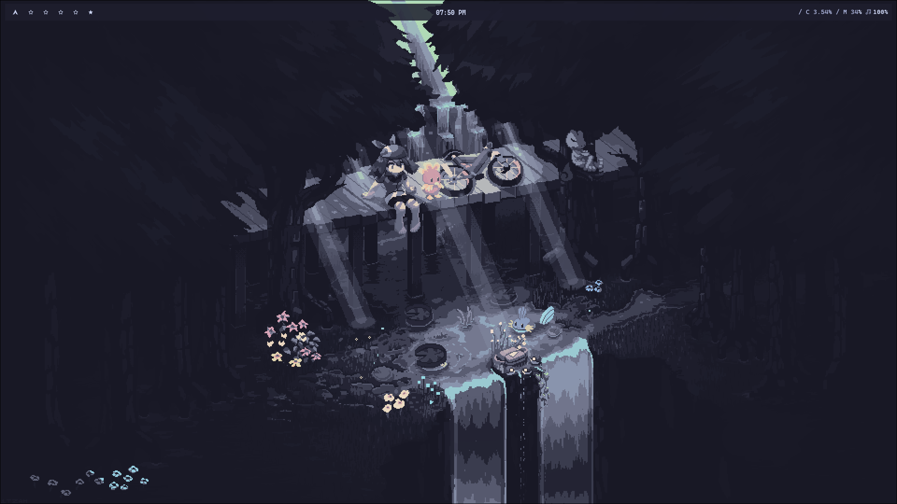

-- --
# Hello! 👋

This is my **dotfile**

Ingredients: Catppuccin, Hyprland, Waybar, Rofi, Firefox...

## Install

```bash
# Update system
sudo pacman -Syu

# Install base packages
sudo pacman -S \
    git \
    curl \
    firefox \
    obsidian \
    rofi \
    steam \
    postgresql \
    docker \
    neovim \
    telegram-desktop \
    nautilus \
    rofi-emoji \
    pavucontrol \
    zsh

# Install yay
sudo pacman -S --needed git base-devel && \
git clone https://aur.archlinux.org/yay.git && \
cd yay && makepkg -si

# Install AUR packages via yay
yay -S \
    ttf-jetbrains-mono-nerd \
    visual-studio-code-bin

# Install and configure Oh My Zsh
sh -c "$(curl -fsSL https://raw.githubusercontent.com/ohmyzsh/ohmyzsh/master/tools/install.sh)"

# Set zsh as default shell
chsh -s $(which zsh)

# Install asdf version manager and plugins
git clone https://aur.archlinux.org/asdf-vm.git && \
cd asdf-vm && makepkg -si

. "$HOME/.asdf/asdf.sh"

asdf plugin add nodejs && \
asdf install nodejs latest && \
asdf global nodejs latest

asdf plugin add ruby && \
asdf install ruby latest && \
asdf global ruby latest

asdf plugin add python && \
asdf install python latest && \
asdf global python latest

asdf plugin add go && \
asdf install go latest && \
asdf global go latest

asdf plugin add lua && \
asdf install lua latest && \
asdf global lua latest
```

## Preview:




-- --